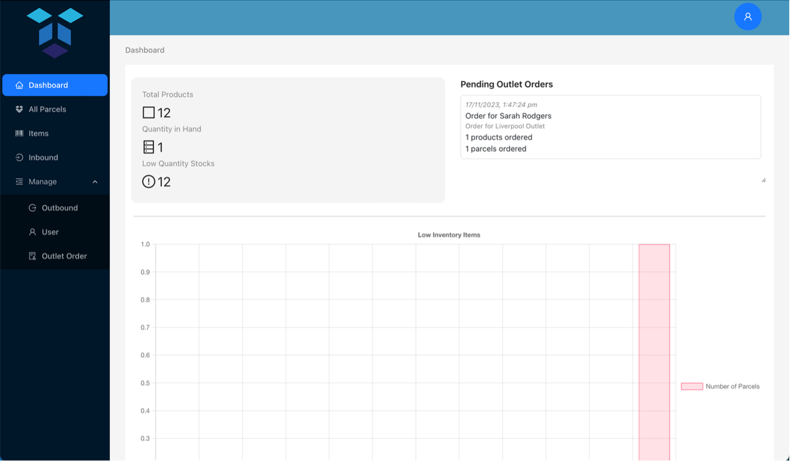
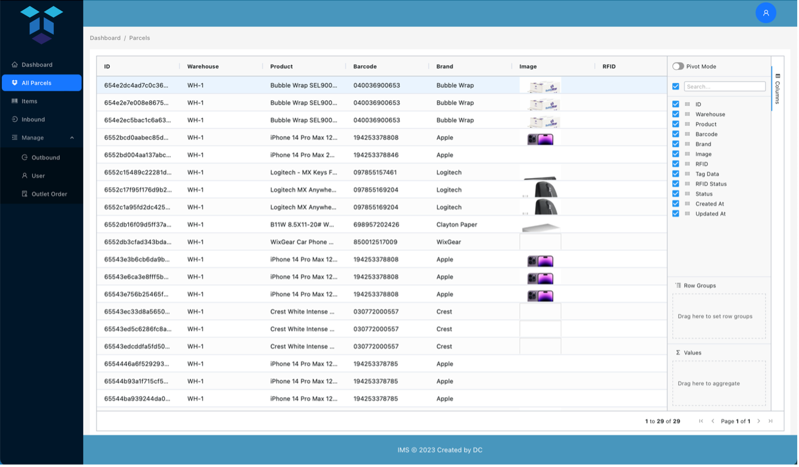
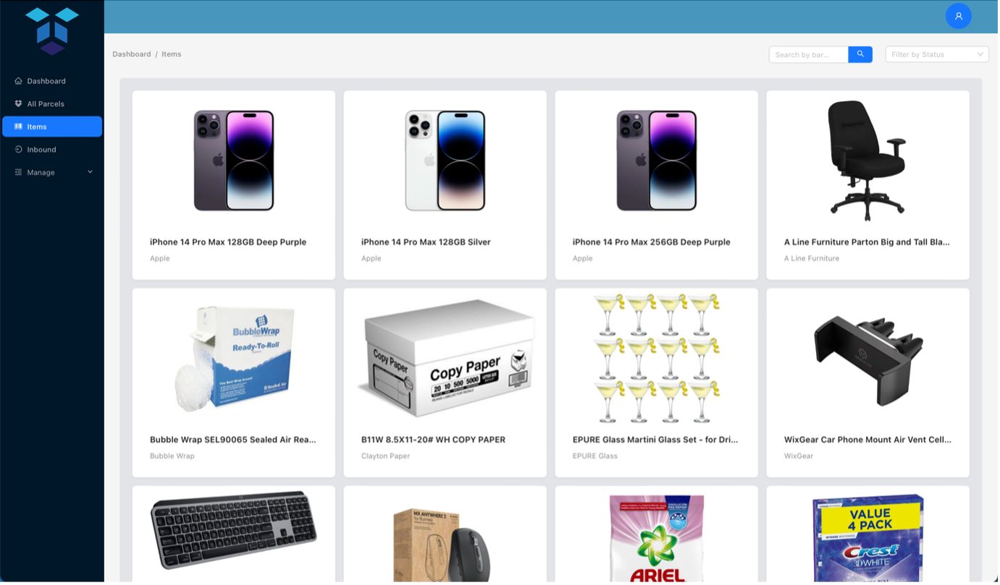
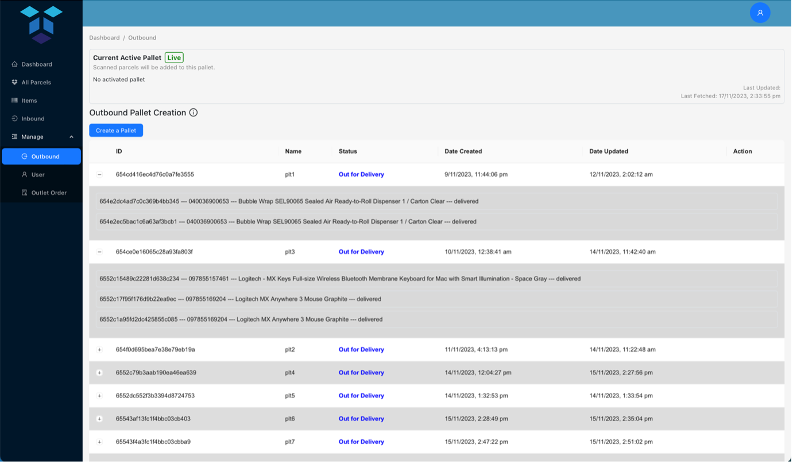
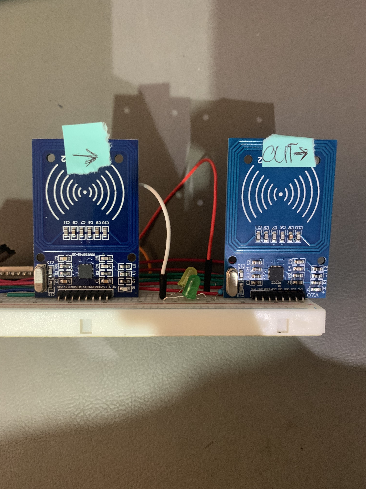
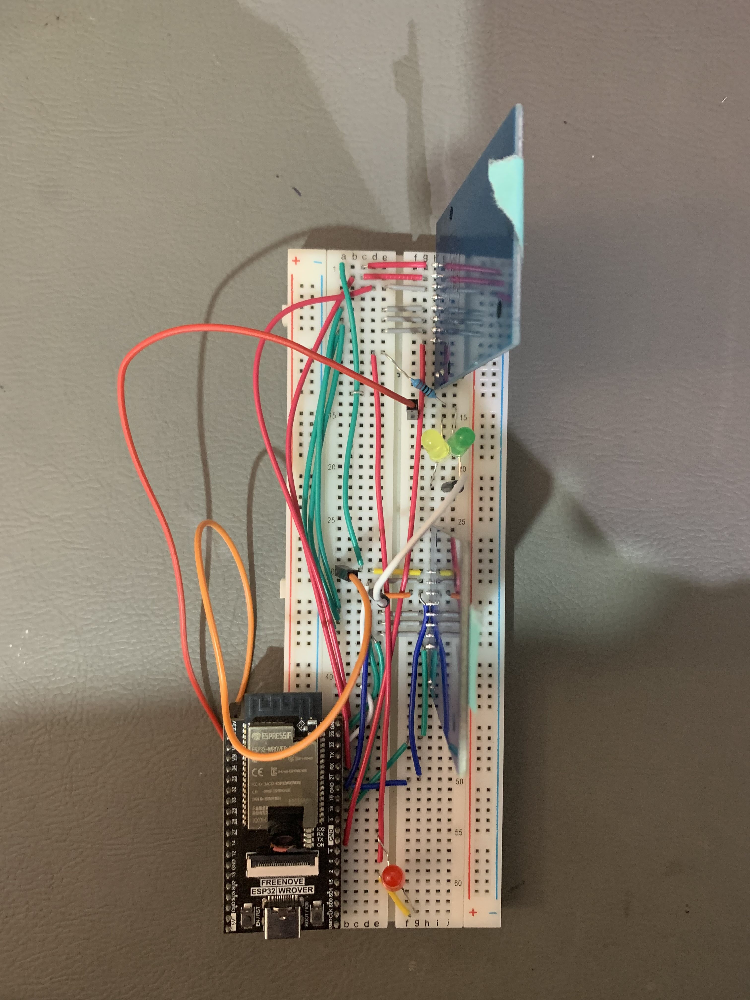

# Inventory Management System

A Smart Inventory System leveraging RFID technology to enhance efficiency in Inbound and Outbound Warehouse Processes.

## 🚀 Features

### IoT Integration
- **Inbound Scanning**: Real-time tracking of incoming goods
- **Live Pallet Updates**: Instant updates on the number of goods per pallet
- **Outbound Scanning**: Efficient tracking of outgoing inventory
- **Real-time Outbound Monitoring**: Live updates on goods loaded onto outbound pallets

### Software Capabilities
- **Inventory Management**: Comprehensive tracking and control of stock levels
- **Product Management**: Detailed product information and categorization
- **User Authentication**: Secure user management and access control
- **Admin Dashboard**: Intuitive overview of inventory metrics and operations

## 📸 Screenshots

  
  
  
  

---

  
  

## 🛠 Tech Stack

- **Database**: MongoDB
- **Backend**: Node.js with Express
- **Frontend**: React, Chart.js, Ag-Grid

## 📄 License

This project is licensed under the [MIT License]().

## 📬 Contact

For any queries, please open an issue in the repository.

